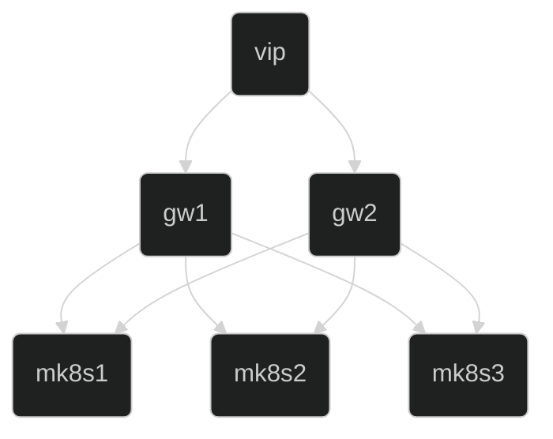

# **microcloud**
A runbook to deploy a 3 node HA microk8s cluster (mk8s1-3) and a 2 node HA VPN gateway and reverse proxy (gw1-2) for access.
* The gateway nodes require 2 NIC's (outside & inside the cluster network).



| ID  | TASK | DESCRIPTION | 
| --- | ---- | ----------- |
| [1](#network) | Configure network on all nodes | Gateway nodes get (inside) and (outside) networks. Microk8s nodes get (inside) network.
| [2](#firewalld) | Install firewalld on all nodes | Firewalld provides a dynamically managed firewall with support for network/firewall zones that define the trust level of network connections or interfaces | 
| [3](#cockpit) | Install cockpit on all nodes | Cockpit is a web-based graphical interface for servers | 
| [4](#libreswan) | Install libreswan on gateway nodes | Libreswan is a free software implementation of the most widely supported and standardized VPN protocol using "IPsec" and the Internet Key Exchange ("IKE") | 
| [5](#frrouting) | Install frrouting on gateway nodes | FRRouting (FRR) is a free and open source Internet routing protocol suite for Linux and Unix platforms. It implements BGP, OSPF, RIP, IS-IS, PIM, LDP, BFD, Babel, PBR, OpenFabric and VRRP, with alpha support for EIGRP and NHRP |
| [6](#haproxy) | Install haproxy on gateway nodes | HAProxy is a free, very fast and reliable reverse-proxy offering high availability, load balancing, and proxying for TCP and HTTP-based applications |
| [7](#microk8s) | Install microk8s on microk8s nodes | Microk8s is zero-ops, pure-upstream Kubernetes, from developer workstations to production. |

## [netplan](https://netplan.io/)
```shell
# All nodes hosts entries
sudo nano /etc/hosts

192.168.1.11 gw-1
192.168.2.12 gw-2
192.168.3.11 mk8s-1
192.168.3.12 mk8s-2
192.168.3.13 mk8s-3


# All nodes NTP

sudo nano /etc/systemd/timesyncd.conf
[Time]
NTP=( Your Time Server )


# Gateway nodes (inside) & (outside) networks.
sudo nano /etc/netplan/*.yaml
network:
  ethernets:
    eth0:
    # outside
      addresses:
      - 192.168.1.11/24
      routes:
      - to: default
        via: 192.168.1.1
      nameservers:
        addresses:
        - 8.8.8.8
        - 8.8.4.4
        search:
        - .local
      renderer: NetworkManager
    eth1:
    # inside
      addresses:
      - 192.168.3.1/24
  version: 2
  


# Gateway nodes (inside) & (outside) networks.
sudo nano /etc/netplan/*.yaml

network:
  ethernets:
    eth0:
    # inside 
      addresses:
      - 192.168.3.11/24
      routes:
      - to: default
        via: 192.168.1.1
      nameservers:
        addresses:
        - 8.8.8.8
        - 8.8.4.4
        search:
        - .local
      renderer: NetworkManager
  version: 2


```
## [firewalld](https://firewalld.org/)
```shell
sudo apt-get install firewalld

# enable logging
sudo firewall-cmd --set-log-denied=all

# Enable IP Rorwarding on gateway nodes only
sudo nano /etc/sysctl.conf

net.ipv4.ip_forward=1

# Attackers could use bogus ICMP redirect messages to maliciously alter the system routing tables
net.ipv4.conf.all.accept_redirects = 0
net.ipv4.conf.all.send_redirects = 0
net.ipv4.conf.default.send_redirects = 0
net.ipv4.conf.default.accept_redirects = 0

# Enable IP masquerade on gateway nodes only
sudo firewall-cmd --add-masquerade --permanent
sudo firewall-cmd --reload
```
## [cockpit](https://cockpit-project.org/)
```shell
sudo apt-get install cockpit
```
## [libreswan](https://libreswan.org/)
```shell
# ubuntu raspi extras not included in image
# sudo apt-get install linux-modules-extra-5.15.0-1017-raspi

sudo apt-get install libreswan
```
## [frrouting](https://frrouting.org/)
```shell
sudo apt-get install frr

# Enable BGP
sudo nano /etc/frr/daemons

bgpd=yes

sudo systemctl restart frr
```
### [haproxy](https://www.haproxy.org/)
```shell
sudo apt-get install haproxy
```
### [microk8s](https://microk8s.io/docs/getting-started)
```shell
sudo snap install microk8s --classic --channel=1.26

# join the microk8s group
sudo usermod -a -G microk8s $USER

# take ownership of the config files
sudo chown -f -R $USER ~/.kube

# re-enter the session
su - $USER

# microk8s servces for firewalld
sudo cp services/*.xml  /usr/lib/firewalld/services/ 

# calico vxlan firewalld rules
sudo firewall-cmd --zone=trusted --add-interface=vxlan.calico --permanent

# calico pod networks
sudo firewall-cmd --zone=trusted --add-source=10.0.0.0/8  --permanent 
sudo firewall-cmd --reload
```

