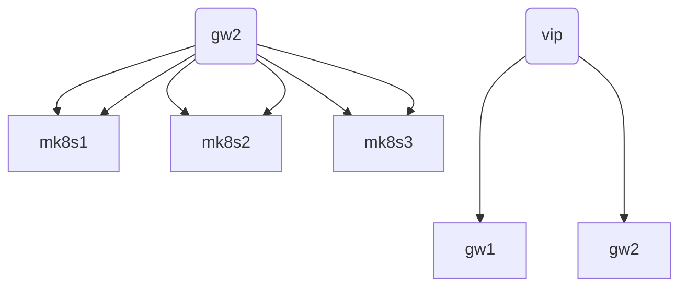

# **microcloud**
A runbook to deploy a 3 node HA microk8s cluster (mk8s1-3) and a 2 node HA VPN gateway and reverse proxy (gw1-2) for access.



| ID  | TASK | DESCRIPTION | 
| --- | ---- | ----------- |
| 1 | Install firewalld on gw1-2 | Firewall to protect the gateway and cluster | 
| 2 | Install cockpit on gw1-2 | Web-based graphical interface for servers | 

### vpn gateway and reverse proxy
```
sudo apt-get install firewalld
sudo apt-get install cockpit
# ubuntu raspi extras
# sudo apt-get install linux-modules-extra-5.15.0-1017-raspi
sudo apt-get install libreswan
sudo apt-get install frr
sudo apt-get install haproxy

nano /etc/sysctl.conf

net.ipv4.ip_forward=1
net.ipv4.conf.all.accept_redirects = 0
net.ipv4.conf.all.send_redirects = 0
net.ipv4.conf.default.send_redirects = 0
net.ipv4.conf.default.accept_redirects = 0


nano /etc/frr/daemons 
# bgpd=no
bgpd=yes

```

### [microk8s](https://microk8s.io/docs/getting-started)
#### 1. install
```shell
sudo snap install microk8s --classic --channel=1.26
```
#### 2. join the microk8s group
```shell
sudo usermod -a -G microk8s $USER
sudo chown -f -R $USER ~/.kube
```
#### 3. re-enter the session
```shell
su - $USER
```
### [firewalld](https://firewalld.org/)
#### 1. install
```shell
sudo apt-get install firewalld
```
#### 2. calico vxlan overlay
```shell
sudo firewall-cmd --zone=trusted --add-interface=vxlan.calico --permanent
```
#### 3. calico pod networks
```shell
sudo firewall-cmd --zone=trusted --add-source=10.0.0.0/8  --permanent 
```
#### 4. microk8s servces for firewalld
```shell
sudo cp services/*.xml  /usr/lib/firewalld/services/ 
```
#### 5. log denied
```shell
sudo firewall-cmd --set-log-denied=all
```
### [cockpit](https://cockpit-project.org/)
#### 1. install
```shell
sudo apt-get install cockpit
```
