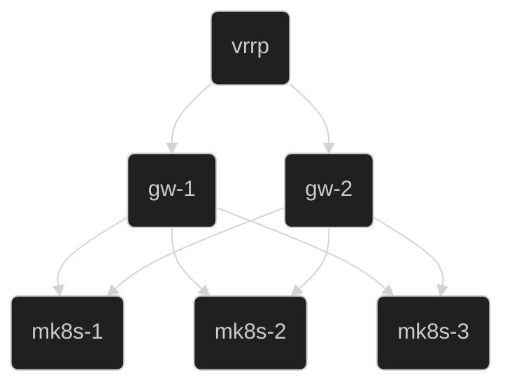

# **microcloud**
A runbook to deploy a 3 node HA microk8s cluster (mk8s1-3) and a 2 node HA VPN gateway and reverse proxy (gw1-2) for access.
* The gateway nodes require 2 NIC's (outside & inside the cluster network).



| ID  | TASK | DESCRIPTION | 
| --- | ---- | ----------- |
| [1](#cockpit) | Install cockpit on all nodes | Cockpit is a web-based graphical interface for servers | 
| [2](#netplan) | Configure network on all nodes | Gateway nodes get (inside) and (outside) networks. Microk8s nodes get (inside) network.
| [3](#firewalld) | Install firewalld on all nodes | Firewalld provides a dynamically managed firewall with support for network/firewall zones that define the trust level of network connections or interfaces | 
| [4](#libreswan) | Install libreswan on gateway nodes | Libreswan is a free software implementation of the most widely supported and standardized VPN protocol using "IPsec" and the Internet Key Exchange ("IKE") | 
| [5](#frrouting) | Install frrouting on gateway nodes | FRRouting (FRR) is a free and open source Internet routing protocol suite for Linux and Unix platforms. It implements BGP, OSPF, RIP, IS-IS, PIM, LDP, BFD, Babel, PBR, OpenFabric and VRRP, with alpha support for EIGRP and NHRP |
| [6](#haproxy) | Install haproxy on gateway nodes | HAProxy is a free, very fast and reliable reverse-proxy offering high availability, load balancing, and proxying for TCP and HTTP-based applications |
| [7](#microk8s) | Install microk8s on microk8s nodes | Microk8s is zero-ops, pure-upstream Kubernetes, from developer workstations to production. |


## [cockpit](https://cockpit-project.org/)
#### 1. Start with the gateway to build access to the rest of the cluster. Once the gateway is complete, the rest of hosts can be managed from cockpit. https://192.168.1.11:9090
```shell
sudo apt-get install cockpit

sudo systemctl start cockpit
```
## [netplan](https://netplan.io/)
#### 1. Configure the gateway nodes public and trusted networks. 
```shell
sudo nano /etc/netplan/*.yaml
network:
  ethernets:
    eth0:
    # public zone
      addresses:
      - 192.168.1.11/24
      routes:
      - to: default
        via: 192.168.1.1
      nameservers:
        addresses:
        - 8.8.8.8
        - 8.8.4.4
        search:
        - .local
    eth1:
    # trusted zone
      addresses:
      - 192.168.3.1/24
      # gw-1 192.168.3.2
      # gw-2 192.168.3.3
      # VRRP 192.168.3.1 (FRRouting)
  version: 2
  renderer: NetworkManager
  # cockpit uses NetworkManager
  
sudo netplan try
[enter]
```
#### 2. Configure microk8s nodes public network.
```shell
sudo nano /etc/netplan/*.yaml

network:
  ethernets:
    eth0:
    # public 
      addresses:
      - 192.168.3.11/24
      routes:
      - to: default
        via: 192.168.3.1
      nameservers:
        addresses:
        - 8.8.8.8
        - 8.8.4.4
        search:
        - .local
  version: 2
  renderer: NetworkManager
  # cockpit uses NetworkManager
  
sudo netplan try
[enter]
```
#### 3. Configure all nodes hosts files to match.
```shell
sudo nano /etc/hosts

# gws zone = public
192.168.1.11 gw-1
192.168.1.12 gw-2

# gws zone = trusted 
192.168.3.1 = vrrp

# mk8s zone = public
192.168.3.11 mk8s-1
192.168.3.12 mk8s-2
192.168.3.13 mk8s-3
```
#### 4. Configure all nodes to use the same NTP server.
```shell
sudo nano /etc/systemd/timesyncd.conf
[Time]
NTP= $NTP_SERVER_IP
```
## [firewalld](https://firewalld.org/)
#### 1. Intsall firewalld on all nodes. Configure logging and add cockpit as a service. 
```shell
sudo apt-get install firewalld
```
#### 2. Enable logging.
```shell
sudo firewall-cmd --set-log-denied=all
```
#### 3. Add the cockpit service to the public interface.
```shell
sudo firewall-cmd --add-service cockpit --permanent
```
#### 4. Apply the firewalld configuration.
```shell
sudo firewall-cmd --reload
```
#### 5. Configure IP forwarding on gateway nodes only. This enables the gateways to preform IP routing. Disable ICMP redirects to prevent attackers from hijacking the routing table.
```shell
sudo nano /etc/sysctl.conf

net.ipv4.ip_forward=1

net.ipv4.conf.all.accept_redirects = 0
net.ipv4.conf.all.send_redirects = 0
net.ipv4.conf.default.send_redirects = 0
net.ipv4.conf.default.accept_redirects = 0
```
#### 6. Apply the system configuration.
```shell
sysctl -p
````
#### 7. Configure IP masquerade on the gateway nodes only. This will allow the gateway to preform network address translation (NAT) for the cluster network.
```
sudo firewall-cmd --add-masquerade --permanent
```
#### 8. Configure the gateway nodes to accept all traffic from the cluster netork.
```
sudo firewall-cmd --permanent --zone=trusted --change-interface=eth1
```
#### 9. Apply the firewalld configuration.
```
sudo firewall-cmd --reload
```
## [libreswan](https://libreswan.org/)
#### 1. Install libreswan on the gateway nodes only. This will enable the gateway to build tunnels to other gateways for multi-cloud connectivity. 
```shell
sudo apt-get install libreswan
````
#### 2. If deploying on raspberry pi hardware, you must install some extra libraries for the encryption to work. 
```shell
sudo apt-get install linux-modules-extra-5.15.0-1017-raspi
````
#### 3. Configure IP addreses and secrets for remote gateway.
```shell
sudo cp ipsec.d/ocigw.conf  /etc/ipsec.d/
```
#### 4. Enable the ipsec service and restart to apply configuration changes.
```shell
sudo systemcrl enable ipsec
sudo systemcrl restart ipsec
```
## [frrouting](https://frrouting.org/)
#### 1. Install free range routing on the gateway nodes.
```shell
sudo apt-get install frr
```
#### 2. Enable BGP for routing table updates.
```shell
sudo nano /etc/frr/daemons

bgpd=yes
````
#### 3. The .conf file has BGP peerings configured on the tunnel interfaces to communicate with a remote gateway.
```shell
sudo cp frr/frr.conf  /etc/frr/
```
#### 4. Restart frr to apply configuration changes.
```shell
sudo systemctl restart frr
```
### [haproxy](https://www.haproxy.org/)
#### 1. Install haproxy on all gateway nodes. This will enable reverse proxy capabilities on the gatways.
```shell
sudo apt-get install haproxy

sudo systemctl enable haproxy
```
#### 2. Edit and load config for 80,443 with proxy protocol and 16443 for microk8s external API access.
```shell
sudo cp haproxy/haproxy.cfg  /etc/haproxy
```
#### 3.  Restart haproxy to apply configuration changes.
```shell
sudo systemctl restart haproxy
```
### [microk8s](https://microk8s.io/docs/getting-started)
#### 1. Install micrk8s on all cluster nodes.
```shell
sudo snap install microk8s --classic --channel=1.26
```
#### 2. Join the microk8s group to inherit permissions.
```shell
sudo usermod -a -G microk8s $USER
```
#### 3. Take ownership of the config file directory.
```shell
sudo chown -f -R $USER ~/.kube
```
#### 4. Re-enter the session for changes to take place.
```shell
su - $USER
```
#### 5. Copy the microk8s servces into the firewalld services directory.
```shell
sudo cp services/*.xml  /usr/lib/firewalld/services/ 
```
#### 6. Enable all micrk8s services in firewalld.
```shell
sudo firewall-cmd --zone=public --permanent --add-service=http 
sudo firewall-cmd --zone=public --permanent --add-service=https 
sudo firewall-cmd --zone=public --permanent --add-service=mk8s-apiserver 
sudo firewall-cmd --zone=public --permanent --add-service=mk8s-calico 
sudo firewall-cmd --zone=public --permanent --add-service=mk8s-cluster-agent 
sudo firewall-cmd --zone=public --permanent --add-service=mk8s-dqlite 
sudo firewall-cmd --zone=public --permanent --add-service=mk8s-etcd 
sudo firewall-cmd --zone=public --permanent --add-service=mk8s-kube-controller 
sudo firewall-cmd --zone=public --permanent --add-service=mk8s-kube-scheduler 
sudo firewall-cmd --zone=public --permanent --add-service=mk8s-kubelet-r 
sudo firewall-cmd --zone=public --permanent --add-service=mk8s-kubelet-rw 
sudo firewall-cmd --zone=public --permanent --add-service=mk8s-observability 
```
#### 7. Apply changes.
```shell
sudo firewall-cmd --reload
```
#### 8. Accept all traffic from the vxlan.calico interface.
```shell
sudo firewall-cmd --zone=trusted --add-interface=vxlan.calico --permanent
```
#### 9. Accept all traffic from the calico pod network subnets.
```shell
sudo firewall-cmd --zone=trusted --add-source=10.0.0.0/8  --permanent 
sudo firewall-cmd --reload
```

#### 10. Add VRRP address from the haproxy proxy to the certificates for external API access
```shell
sudo nano /var/snap/microk8s/current/certs/csr.conf.template
# MOREIP
IP.9 = < VRRP IP >
```
#### 11. Microk8s should auto refresh the certs. Verify cert conf file contains VRRP IP.
```shell
sudo cat sudo nano /var/snap/microk8s/current/certs/csr.conf
```
#### 12. Add nodes to the primary node to form a cluster after all certs have been updated with VRRP IP. 
```shell
microk8s.add-node
```
#### 13. After cluster is formed enable dns, metric server, ingress and observability
```shell
microk8s.enable dns 
microk8s.enable ingrss
microk8s.enable metrics-server
microk8s.enable observability 
```
#### 14. Add proxy protocol support on ingress loadbalancer config.
```shell
microk8s.kubectl edit configmap -n ingress nginx-load-balancer-microk8s-conf

data:
  use-proxy-protocol: "true"
```
# https://kubernetes.io/docs/tasks/tools/install-kubectl-linux/
# install kubectl on gateway nodes to remote manage microk8s

# Download the Google Cloud public signing key
sudo curl -fsSLo /etc/apt/keyrings/kubernetes-archive-keyring.gpg https://packages.cloud.google.com/apt/doc/apt-key.gpg

# Add the Kubernetes apt repository:
echo "deb [signed-by=/etc/apt/keyrings/kubernetes-archive-keyring.gpg] https://apt.kubernetes.io/ kubernetes-xenial main" | sudo tee /etc/apt/sources.list.d/kubernetes.list\

# Update apt package index with the new repository and install kubectl:
sudo apt-get update
sudo apt-get install -y kubectl


# copy config to $HOME/.kube/config
microk8s.config

# edit cluster VIP adress for API 16443
sudo nano $HOME/.kube/config

server: https://192.168.1.11:16443

# add ingress rule for grafana observability access
kubectl apply -f microk8s/grafana-ingress.yaml


```

