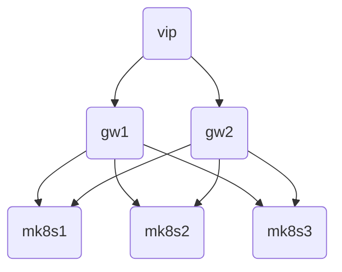

# **microcloud**
A runbook to deploy a 3 node HA microk8s cluster (mk8s1-3) and a 2 node HA VPN gateway and reverse proxy (gw1-2) for access.
* The gateway nodes require 2 NIC's (inside,outside).



| ID  | TASK | DESCRIPTION | 
| --- | ---- | ----------- |
| [1](#firewalld) | Install firewalld on all nodes | Firewalld provides a dynamically managed firewall with support for network/firewall zones that define the trust level of network connections or interfaces | 
| [2](#cockpit) | Install cockpit on all nodes | Cockpit is a web-based graphical interface for servers | 
| [3](#libreswan) | Install libreswan on gateway nodes | Libreswan is a free software implementation of the most widely supported and standardized VPN protocol using "IPsec" and the Internet Key Exchange ("IKE") | 
| [4](#frrouting) | Install frrouting on gateway nodes | FRRouting (FRR) is a free and open source Internet routing protocol suite for Linux and Unix platforms. It implements BGP, OSPF, RIP, IS-IS, PIM, LDP, BFD, Babel, PBR, OpenFabric and VRRP, with alpha support for EIGRP and NHRP |
| [5](#haproxy) | Install haproxy on gateway nodes | HAProxy is a free, very fast and reliable reverse-proxy offering high availability, load balancing, and proxying for TCP and HTTP-based applications |
| [6](#microk8s) | Install microk8s on microk8s nodes | Microk8s is zero-ops, pure-upstream Kubernetes, from developer workstations to production. |


### [firewalld](https://firewalld.org/)
```shell
sudo apt-get install firewalld
```
### [cockpit](https://cockpit-project.org/)
```shell
sudo apt-get install cockpit
```
### [libreswan](https://libreswan.org/)
```shell
# ubuntu raspi extras not included in image
# sudo apt-get install linux-modules-extra-5.15.0-1017-raspi

sudo apt-get install libreswan
```
### [frrouting](https://frrouting.org/)
```shell
sudo apt-get install frr
```
##### Enable BGP
```
nano /etc/frr/daemons

bgpd=yes
```
##### Enable IP Rorwarding
```
sudo nano /etc/sysctl.conf

net.ipv4.ip_forward=1
net.ipv4.conf.all.accept_redirects = 0
net.ipv4.conf.all.send_redirects = 0
net.ipv4.conf.default.send_redirects = 0
net.ipv4.conf.default.accept_redirects = 0

```
### [haproxy](https://www.haproxy.org/)
```shell
sudo apt-get install haproxy
```
### [microk8s](https://microk8s.io/docs/getting-started)
```shell
sudo snap install microk8s --classic --channel=1.26

# join the microk8s group
sudo usermod -a -G microk8s $USER

# take ownership of the config files
sudo chown -f -R $USER ~/.kube

# re-enter the session
su - $USER
```


### vpn gateway and reverse proxy
```
sudo apt-get install firewalld
sudo apt-get install cockpit
# ubuntu raspi extras
# sudo apt-get install linux-modules-extra-5.15.0-1017-raspi
sudo apt-get install libreswan
sudo apt-get install frr
sudo apt-get install haproxy

nano /etc/sysctl.conf

net.ipv4.ip_forward=1
net.ipv4.conf.all.accept_redirects = 0
net.ipv4.conf.all.send_redirects = 0
net.ipv4.conf.default.send_redirects = 0
net.ipv4.conf.default.accept_redirects = 0


nano /etc/frr/daemons 
# bgpd=no
bgpd=yes
```


#### 2. calico vxlan overlay
```shell
sudo firewall-cmd --zone=trusted --add-interface=vxlan.calico --permanent
```
#### 3. calico pod networks
```shell
sudo firewall-cmd --zone=trusted --add-source=10.0.0.0/8  --permanent 
```
#### 4. microk8s servces for firewalld
```shell
sudo cp services/*.xml  /usr/lib/firewalld/services/ 
```
#### 5. log denied
```shell
sudo firewall-cmd --set-log-denied=all
```
### [cockpit](https://cockpit-project.org/)
```shell
sudo apt-get install cockpit
```
